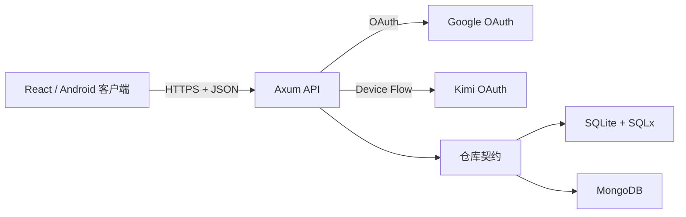
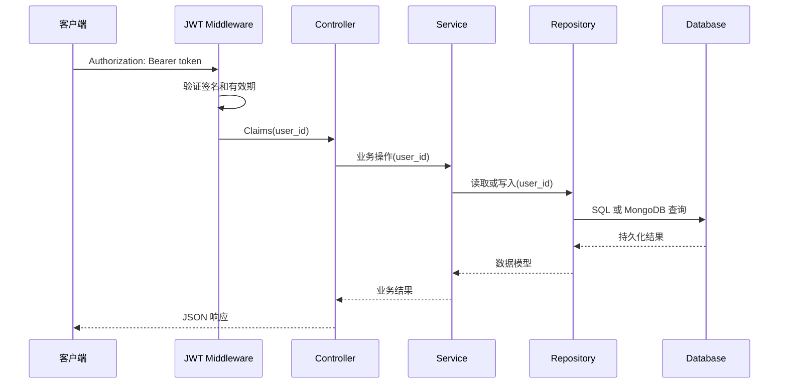

# 系统架构

本文档描述墨言单词后端的当前架构、模块边界、数据持久化策略以及后续演进约束。以代码实现为准，不将尚未实现的能力表述为现有架构。

## 1. 系统上下文

系统由 React 前端、Rust API 和可替换的数据存储组成。后端负责 OAuth 登录、JWT 鉴权、学习数据同步和健康检查。



SQLite 是默认存储。启动时通过 `DATABASE_BACKEND` 选择 SQLite 或 MongoDB，一个进程只使用一种存储实现。

## 2. 架构原则

当前采用面向 REST API 的 MVC + Service + Repository 结构。服务层承载具体业务编排，仓库层支持 SQLite 与 MongoDB 的切换。

- Controller 不能直接执行 SQL、BSON 查询或持有数据库连接。
- Service 负责业务流程、同步时间戳和业务标识生成，不包含 HTTP 协议细节。
- Model 不依赖 SQLx 行映射；SQLite 行类型仅存在于 SQLite 仓库内。
- 跨多表或多集合的数据操作通过 `LearningRepository` 暴露，避免上层理解存储结构。
- 存储错误统一映射为 `RepositoryError`，HTTP 层再转换为 `AppError`。

## 3. 模块边界

```text
src/
├── main.rs                 配置、仓库初始化、Router 和服务器
├── routes/                 HTTP 路由声明和中间件组装
├── controllers/            HTTP 控制器：认证、同步和健康检查
├── services/               业务服务：认证用户、学习同步和健康检查
├── middleware/             JWT 鉴权、共享状态和 HTTP 错误映射
├── models/                 用户、学习数据和 HTTP DTO
└── repositories/           仓库接口、SQLite/MongoDB 实现和后端选择
```

请求路径固定为 `route -> controller -> service -> repository -> database`。控制器处理请求校验、认证上下文和响应转换；服务处理业务编排；仓库处理持久化细节。

## 4. 仓库契约

| 契约 | 聚合/职责 | 主要操作 |
|---|---|---|
| `UserRepository` | 用户聚合 | 按第三方身份原子查找或创建用户、按 ID 查询 |
| `LearningRepository` | 用户学习数据 | 上传、下载、同步状态和统计 |
| `HealthRepository` | 运行状态 | 数据库连通检查、返回当前后端名称 |

启动时创建 `Arc<dyn Repository>` 并注入 `AppState`。`SqliteRepositories` 与 `MongoRepositories` 实现同一接口；运行时后端选择只发生在 `repositories::repository_from_env`。

## 5. 关键请求链路

### 5.1 JWT 鉴权请求



### 5.2 学习数据上传

1. JWT middleware 将用户 ID 放入 request extensions。
2. Sync controller 解析 `UploadRequest`，并调用 `SyncService::upload`。
3. Sync service 生成同步 ID 和时间戳，再调用 `LearningRepository::upload`。
4. 仓库按 `user_id` 隔离卡组、卡片和复习记录，更新用户的 `last_sync_at`。

## 6. 持久化设计

### 6.1 SQLite

- 连接时自动执行 `migrations/` 中的迁移。
- 学习数据上传使用单个数据库事务，卡组、卡片、复习记录和同步时间要么全部成功，要么全部回滚。
- 用户登录通过 `(provider, provider_id)` 唯一索引和 `ON CONFLICT` 实现原子 upsert。
- SQLite 行类型与模型的转换仅存在于 `repositories/sqlite.rs`。

### 6.2 MongoDB

- 启动时创建用户身份、用户卡组、用户卡片和复习记录的唯一索引。
- 所有学习数据文档都包含 `user_id`，查询和 upsert 必须同时按 `user_id` 与业务 ID 限定。
- 用户登录使用 `findOneAndUpdate + upsert`，保证并发请求只得到一个用户记录。
- 当前 MongoDB Compose 使用单节点。学习数据上传是多集合 upsert，不具备 SQLite 的整体事务原子性。如需强一致性，应将 MongoDB 部署为 replica set，再在仓库内加入 session transaction。

## 7. 配置与部署

| 变量 | 默认值 | 用途 |
|---|---|---|
| `DATABASE_BACKEND` | `sqlite` | 选择 `sqlite` 或 `mongodb` |
| `DATABASE_URL` | `sqlite:data/moyan.db` | SQLite 路径或 MongoDB URI |
| `MONGODB_DATABASE` | `moyan` | MongoDB 数据库名 |
| `JWT_SECRET` | 仅开发默认值 | JWT 签名密钥，生产环境必须显式配置 |
| `ALLOWED_ORIGINS` | localhost 地址 | 允许的 CORS origins，逗号分隔 |

SQLite 模式：

```bash
docker compose up -d --build
```

MongoDB 模式：

```bash
DATABASE_BACKEND=mongodb \
DATABASE_URL=mongodb://mongodb:27017 \
docker compose --profile mongodb up -d --build
```

## 8. 测试与可观测性

- `cargo test` 覆盖 SQLite 仓库的用户 upsert、学习数据上传、下载、状态和统计。
- MongoDB 适配器会通过编译检查；需要真实 MongoDB 的集成测试尚未加入自动化测试套件。
- `TraceLayer` 记录 HTTP 请求跟踪，仓库错误在 HTTP 错误边界统一记录。
- `/api/health` 检查当前数据库连通性，并返回 `database_backend`。

## 9. 演进约束

增加新的存储实现时：

1. 实现现有仓库契约，不得在 controller 中增加特定数据库分支。
2. 在 `repositories::repository_from_env` 中增加后端选择。
3. 保持用户数据隔离、登录 upsert 唯一性和同步返回语义一致。
4. 增加契约测试，并在文档中说明事务和一致性差异。

新增业务时先新增或扩展对应 service；仅当多个服务共享复杂规则时，再拆分独立的领域模块，避免过早引入额外层级。
